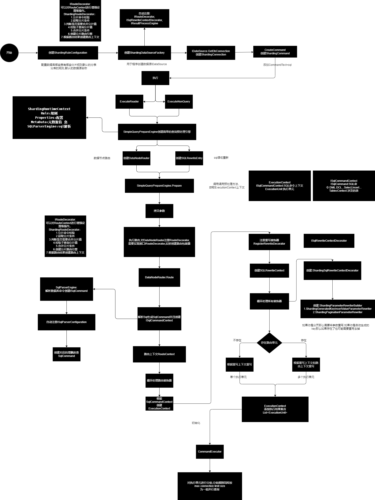

# ShardingConnector

## ShardingRuleConfiguration
整个项目的分片规则配置
- TableRuleConfigs 用来存储各个表的分片规则
- DefaultTableShardingStrategyConfig 默认的分表策略配置
- DefaultDatabaseShardingStrategyConfig 默认分库策略配置
- DefaultDataSourceName 默认数据源名称

## ShardingDataSourceFactory
用于创建IDataSource
## IDataSource
用于创建DbConnection

### GenericDataSource
通用的数据源实现
### ShardingDataSource
分片的数据源实现

## ShardingRuntimeContext

### 分片规则
### 配置信息
### 数据库类型
### 执行引擎
### sql解析引擎
### 获取分片元信息

